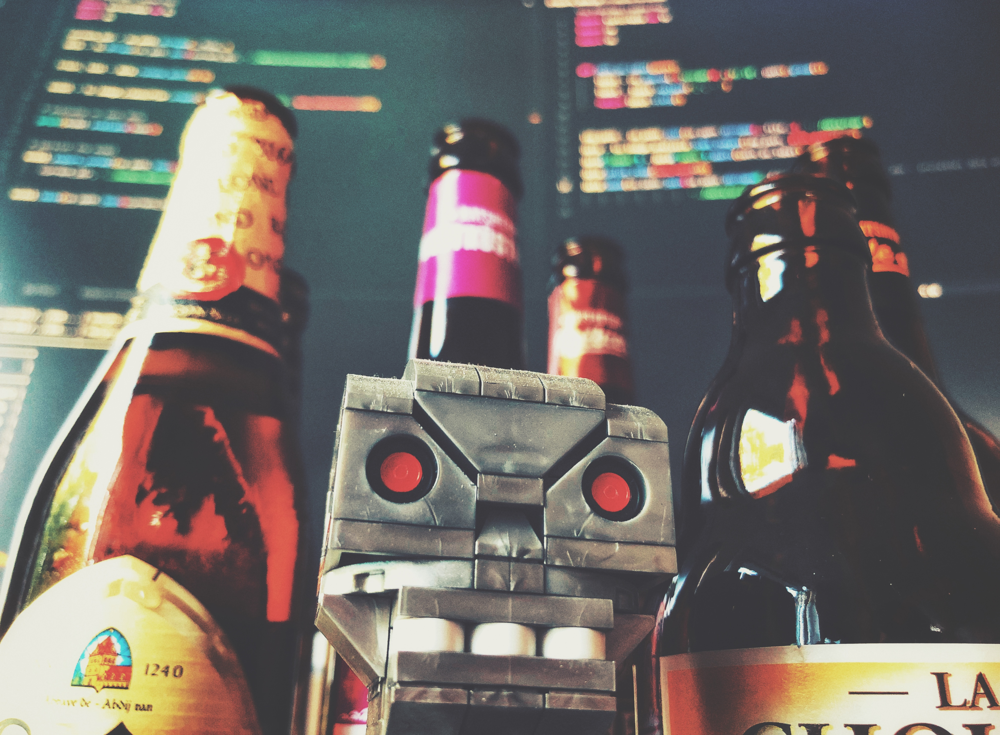
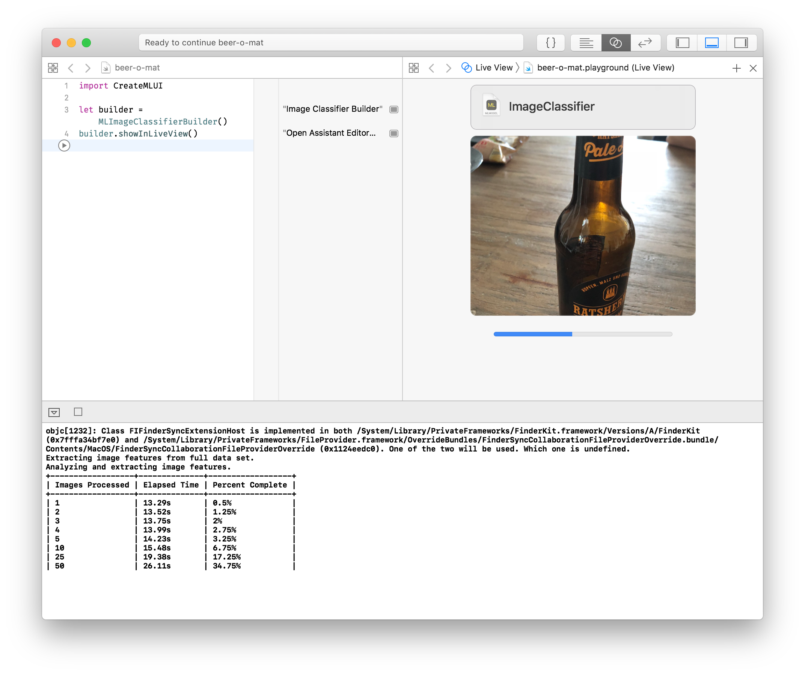

- [Beer-O-Mat](#beer-o-mat)
  - [What is it?](#what-is-it)
  - [usage](#usage)
    - [setup](#setup)
    - [label data](#label-data)
    - [train the model](#train-the-model)
    - [test](#test)

# Beer-O-Mat

## What is it?

An image classifier, trained on beer labels.

Check out the [article on medium](https://medium.com/@oem_83498/get-your-machine-learning-model-into-production-243572a79d) for an in-depth description.

### Xcode 10:

Uses Xcode Playgrounds and CreateML to create a much smaller model. The resulting Model is only 99 KB in comparison to 94,3 MB using TuriCreate.

## usage

### setup

* Install macOS Mojave and Xcode 10 Beta 3

### train the model

* Open the Xcode Playground and click "Train" in the Live View

### test

* Open the Xcode Playground and drop some images into the testing area (after you are done training)
